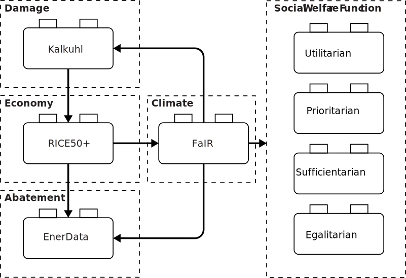
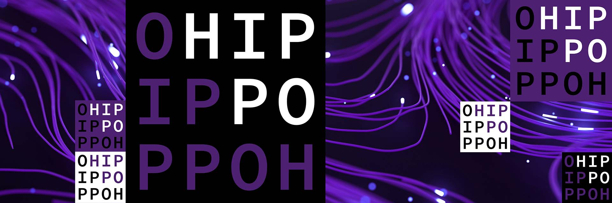

# JUSTICE Integrated Assessment Framework


[](https://doi.org/10.5281/zenodo.15710403)

<p align="center">
  
</p>

JUSTICE (JUST Integrated Climate Economy) is an open-source Integrated Assessment Modelling Framework allowing exploration of modelling assumptions on Climate Policies. JUSTICE is a simulation-optimization model that enables multiobjective optimization using Multiobjective Evolutionary Algorithm (MOEA) and Multiagent Multiobjective Reinforcement Learning (MOMARL).

JUSTICE is designed to explore the influence on distributive justice outcomes due to underlying modelling assumptions across model components and functions: the economy and climate components, emissions, abatement, damage and social welfare functions. JUSTICE is a simple IAM inspired by the long-established RICE, and RICE50+, and is designed to be a surrogate for more complex IAMs for eliciting normative insights.

### JUSTICE Overview

<p align="center">
  
</p>

### Documentation

The documentation for JUSTICE can be found [here](https://pollockdevis.github.io/JUSTICE/). [PENDING]

JUSTICE is developed by the [HIPPO Lab](https://www.tudelft.nl/ai/hippo-lab) at the Technology, Policy, and Management Faculty of [Delft University of Technology](https://www.tudelft.nl/en/tpm/).

<p align="center">
  
  
</p>

# Citation

To cite this code, please use the information in [CITATION.cff](CITATION.cff) and the following bibtex entry:

```
@inproceedings{ijcai2025p1064,
title = {Exploring Equity of Climate Policies Using Multi-Agent Multi-Objective Reinforcement Learning},
author = {Biswas, Palok and Osika, Zuzanna and Tamassia, Isidoro and Whorra, Adit and Zatarain-Salazar, Jazmin and Kwakkel, Jan and Oliehoek, Frans A. and Murukannaiah, Pradeep K.},
booktitle = {Proceedings of the Thirty-Fourth International Joint Conference on
Artificial Intelligence, {IJCAI-25}},
publisher = {International Joint Conferences on Artificial Intelligence Organization},
editor = {James Kwok},
pages = {9573--9581},
year = {2025},
month = {8},
note = {AI and Social Good},
doi = {10.24963/ijcai.2025/1064},
url = {https://doi.org/10.24963/ijcai.2025/1064},
}
```
